# Appendix E figures

All figures below are embedded from the authoritative PNG files in this directory and are generated by the established Stata analysis workflow. Click any image for the full-resolution file.

<table>
<tr><td width="50%" valign="top"><strong>Coefficient plot: digital-remittance and payment intensity (IURD)</strong> <a href="./fig40_coef_iurd.png">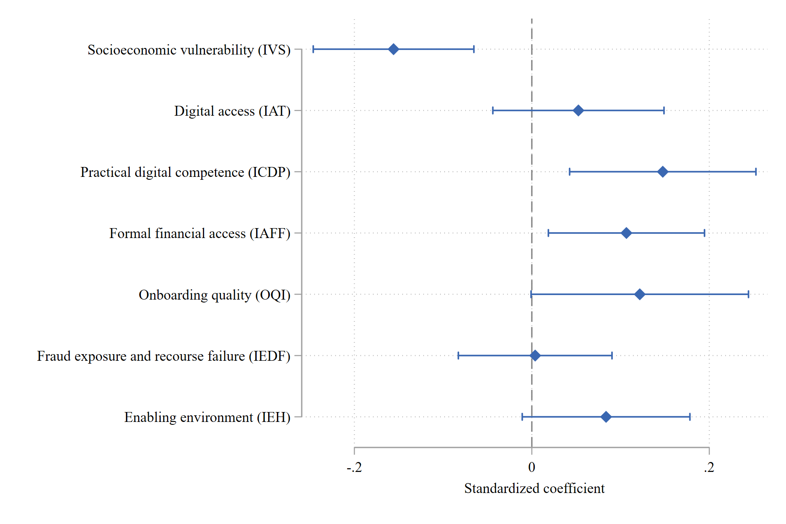</a> <small><a href="./fig40_coef_iurd.png">Open full-resolution PNG</a></small></td><td width="50%" valign="top"><strong>Average marginal effects: formal remittance-channel use</strong> <a href="./fig41_ame_formal_remittance.png">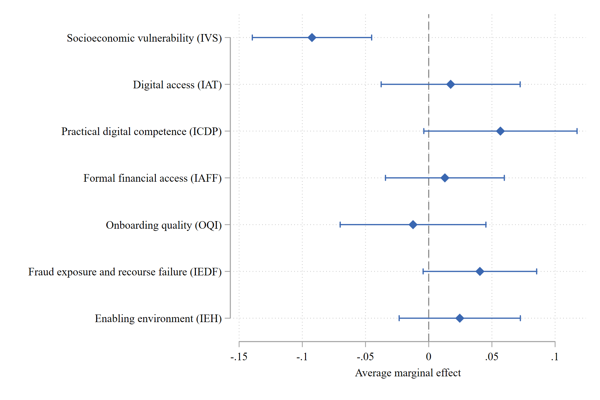</a> <small><a href="./fig41_ame_formal_remittance.png">Open full-resolution PNG</a></small></td></tr>
<tr><td width="50%" valign="top"><strong>Coefficient plot: financial use and operability (IUOF)</strong> <a href="./fig42_coef_iuof.png">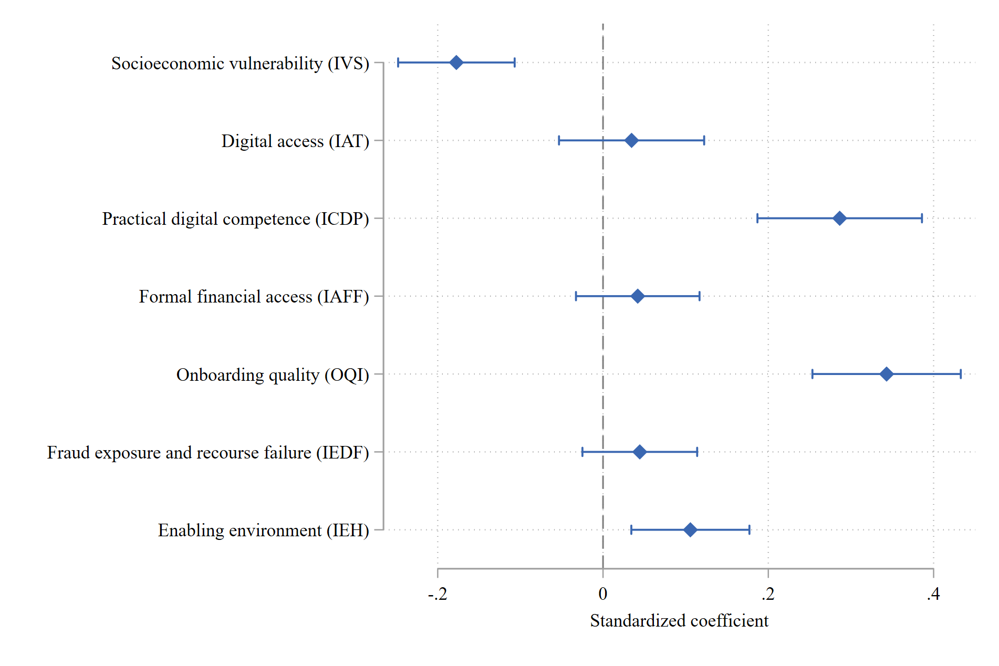</a> <small><a href="./fig42_coef_iuof.png">Open full-resolution PNG</a></small></td><td width="50%" valign="top"><strong>Coefficient plot: transactional experience (IETR)</strong> <a href="./fig43_coef_ietr.png">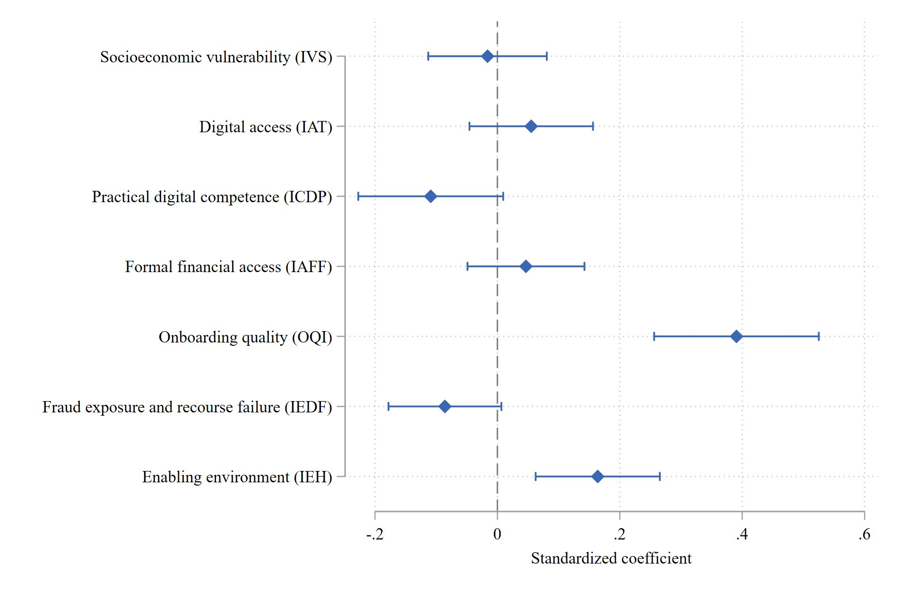</a> <small><a href="./fig43_coef_ietr.png">Open full-resolution PNG</a></small></td></tr>
<tr><td width="50%" valign="top"><strong>Coefficient plot: onboarding quality (OQI)</strong> <a href="./fig44_coef_oqi.png">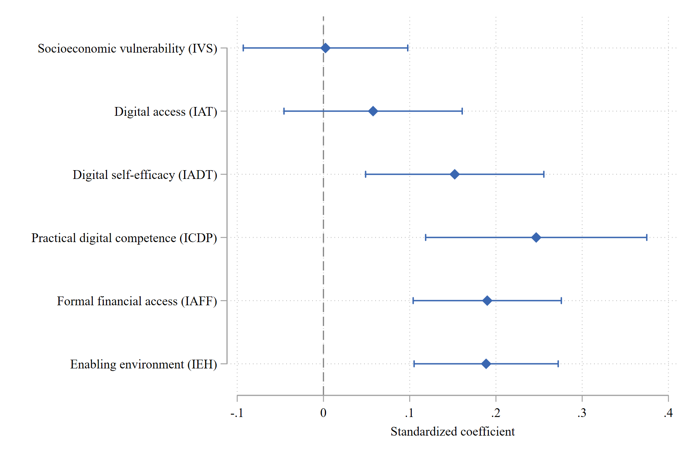</a> <small><a href="./fig44_coef_oqi.png">Open full-resolution PNG</a></small></td><td width="50%" valign="top"><strong>Coefficient plot: prevention and safe conduct (IPCS)</strong> <a href="./fig45_coef_ipcs.png">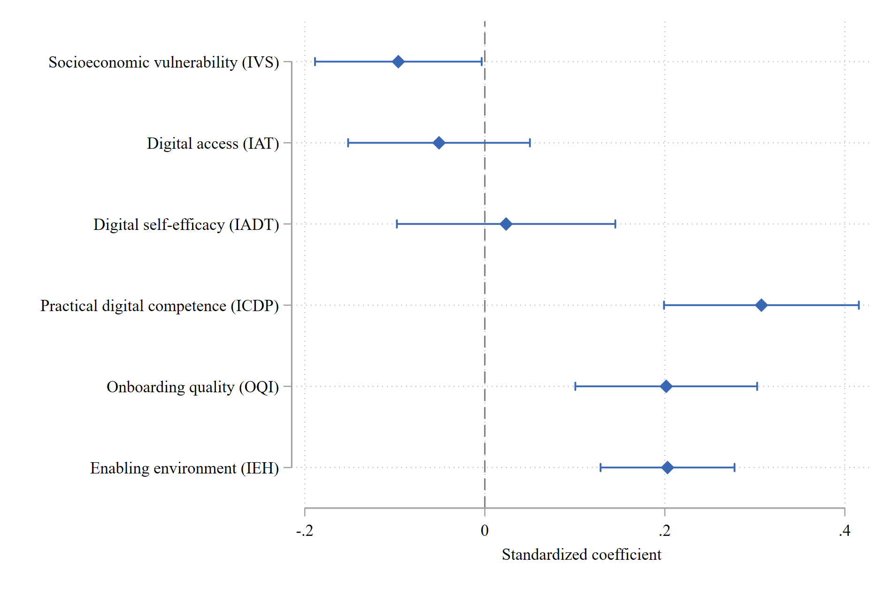</a> <small><a href="./fig45_coef_ipcs.png">Open full-resolution PNG</a></small></td></tr>
<tr><td width="50%" valign="top"><strong>Coefficient plot: fraud exposure and recourse harm (IEDF)</strong> <a href="./fig46_coef_iedf.png">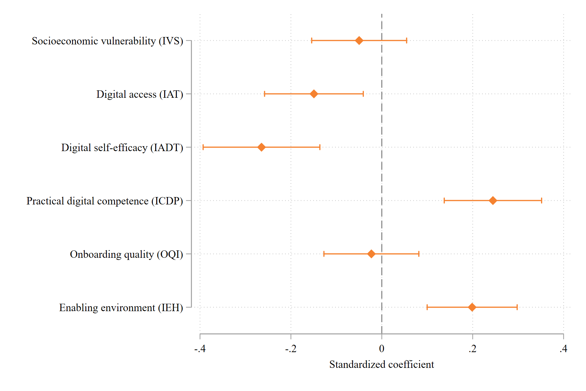</a> <small><a href="./fig46_coef_iedf.png">Open full-resolution PNG</a></small></td><td width="50%" valign="top"><strong>Coefficient plot: economic autonomy in remittances (IAER)</strong> <a href="./fig47_coef_iaer.png">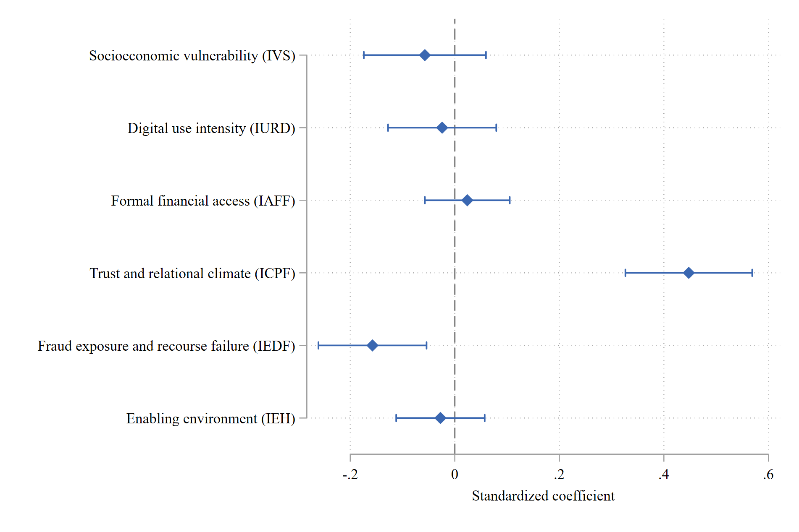</a> <small><a href="./fig47_coef_iaer.png">Open full-resolution PNG</a></small></td></tr>
<tr><td width="50%" valign="top"><strong>Coefficient plot: trust and financial climate (ICPF)</strong> <a href="./fig48_coef_icpf.png">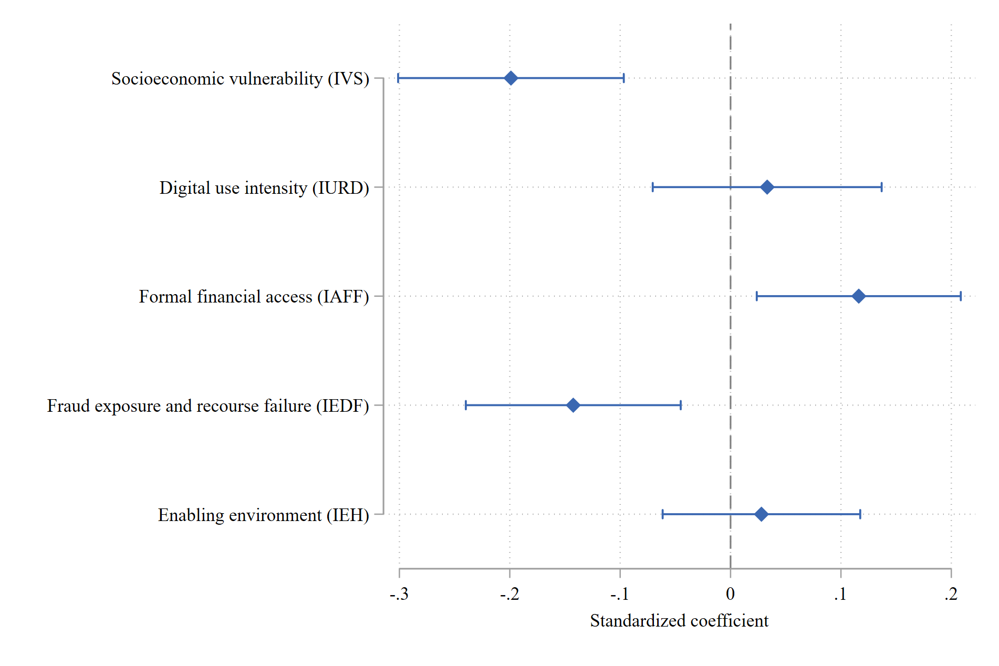</a> <small><a href="./fig48_coef_icpf.png">Open full-resolution PNG</a></small></td><td width="50%" valign="top"><strong>Interaction: socioeconomic vulnerability and telecommunications access</strong> <a href="./fig49_interaction_iurd_ivs_iat.png">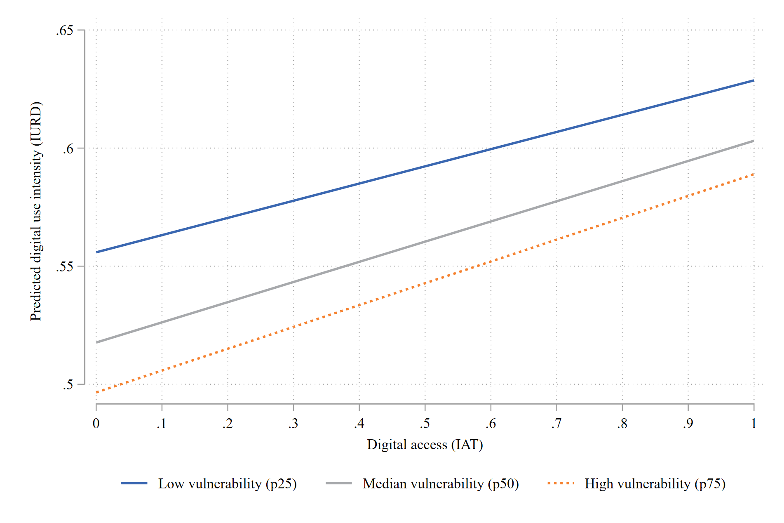</a> <small><a href="./fig49_interaction_iurd_ivs_iat.png">Open full-resolution PNG</a></small></td></tr>
<tr><td width="50%" valign="top"><strong>Interaction: migration tenure and formal financial access</strong> <a href="./fig50_interaction_formal_years_iaff.png">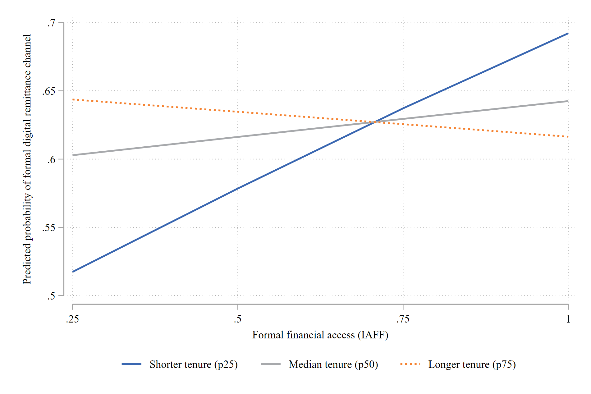</a> <small><a href="./fig50_interaction_formal_years_iaff.png">Open full-resolution PNG</a></small></td><td width="50%" valign="top"><strong>Interaction: practical digital competence and onboarding quality</strong> <a href="./fig51_interaction_ietr_icdp_oqi.png">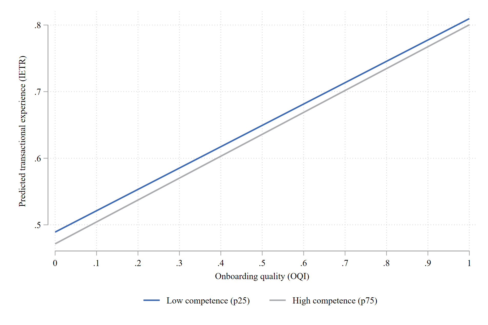</a> <small><a href="./fig51_interaction_ietr_icdp_oqi.png">Open full-resolution PNG</a></small></td></tr>
<tr><td width="50%" valign="top"><strong>Interaction: fraud harm and trust/financial climate</strong> <a href="./fig52_interaction_iurd_iedf_icpf.png">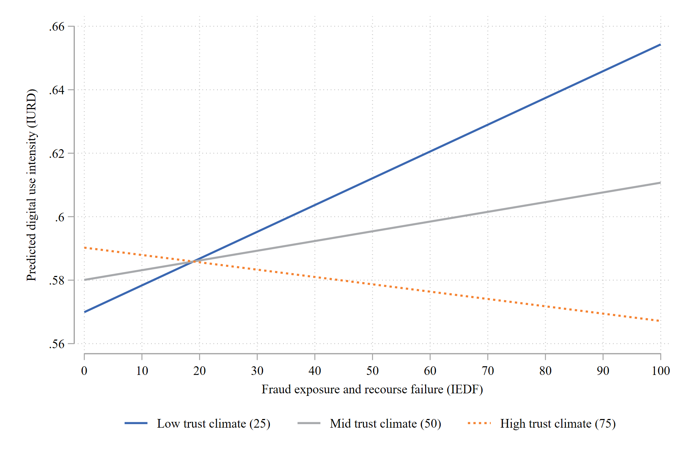</a> <small><a href="./fig52_interaction_iurd_iedf_icpf.png">Open full-resolution PNG</a></small></td><td width="50%"></td></tr>
</table>
