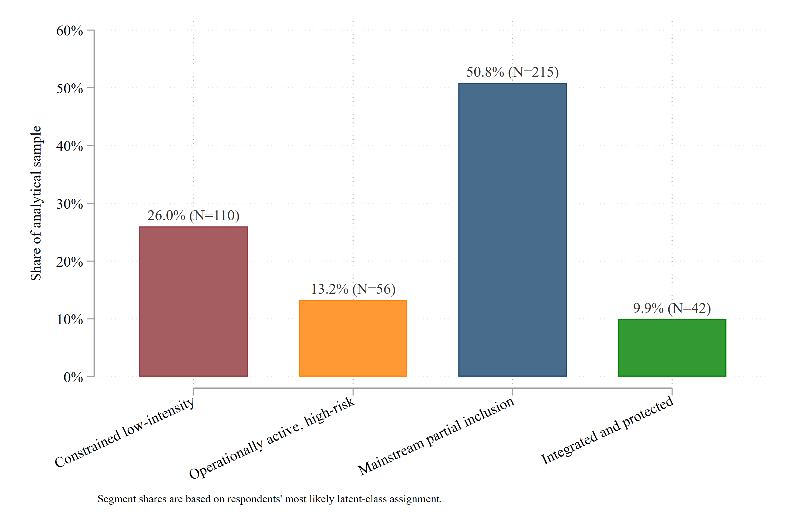
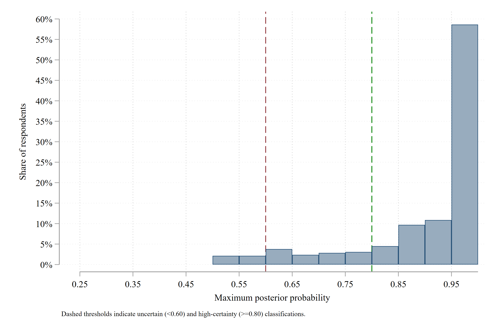
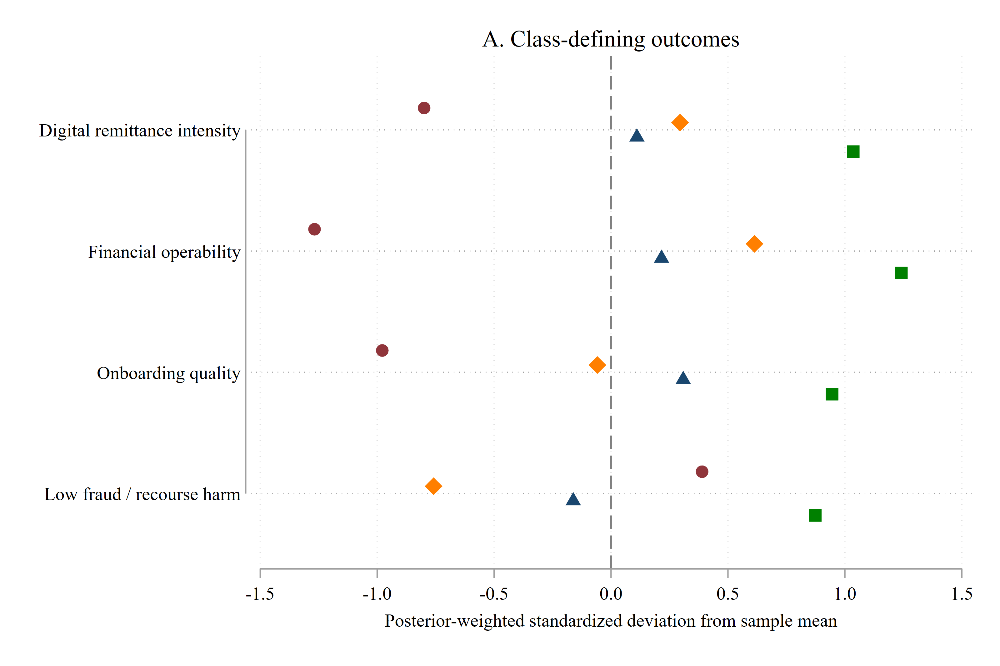

# Appendix G figures

All figures below are embedded from the authoritative PNG files in this directory and are generated by the established Stata analysis workflow. Click any image for the full-resolution file.

<table>
<tr><td width="50%" valign="top"><strong>Class-profile probabilities</strong>  <small><a href="./Figure_G1_Class_Profile_Probabilities.png">Open full-resolution PNG</a></small></td><td width="50%" valign="top"><strong>Standardized segment centroids</strong>  <small><a href="./Figure_G2_Standardized_Centroids.png">Open full-resolution PNG</a></small></td></tr>
<tr><td width="50%" valign="top"><strong>Segment sizes</strong>  <small><a href="./Figure_G3_Segment_Sizes.png">Open full-resolution PNG</a></small></td><td width="50%" valign="top"><strong>Posterior-probability distribution</strong>  <small><a href="./Figure_G4_Posterior_Probability_Distribution.png">Open full-resolution PNG</a></small></td></tr>
<tr><td width="50%" valign="top"><strong>Posterior certainty by segment</strong>  <small><a href="./Figure_G5_Posterior_Certainty_by_Segment.png">Open full-resolution PNG</a></small></td><td width="50%" valign="top"><strong>Class-defining outcomes</strong>  <small><a href="./Figure_G6_Class_Defining_Outcomes.png">Open full-resolution PNG</a></small></td></tr>
<tr><td width="50%" valign="top"><strong>Auxiliary outcomes and mechanisms</strong>  <small><a href="./Figure_G7_Auxiliary_Outcomes_and_Mechanisms.png">Open full-resolution PNG</a></small></td><td width="50%"></td></tr>
</table>
